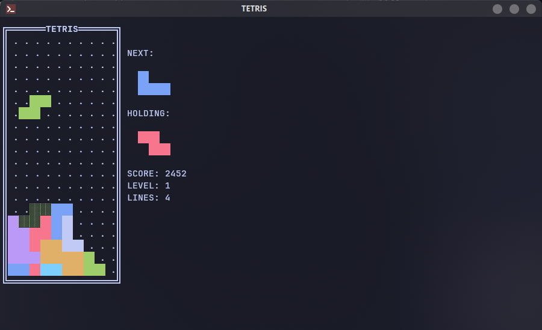

# Tetris

### Modern Tetris TUI written in Rust 🦀



## Installation

The project can be installed from source with the following:

```bash
git clone https://github.com/abusch8/Tetris
cd Tetris
make clean install
```

The repo is also available as a package on the AUR.  It can be installed from source using an AUR helper such as Yay:

```bash
yay -S tetris-tui-git
```

Execute the program with `tetris [start_level]`.

## Configuration

The configuration file is located at `~/.config/tetris.ini`.

The default control scheme is as follows:

|Command            |Key            |
|-------------------|---------------|
|Move Right         |`[→]` / `[D]`  |
|Move Left          |`[←]` / `[A]`  |
|Rotate Right       |`[↑]` / `[W]`  |
|Rotate Left        |`[Z]`          |
|Soft-Drop          |`[↓]` / `[S]`  |
|Hard-Drop          |`[SPACE]`      |
|Hold               |`[C]`          |
|Quit               |`[ESC]` / `[Q]`|

I also recommend that you adjust your keyboard's repeat rate and delay.  It can make the game feel a bit more responsive.

## TODO

- Leaderboard
- T-Spin scoring
- Fix soft drop scoring accuracy
- Prevent infinity

